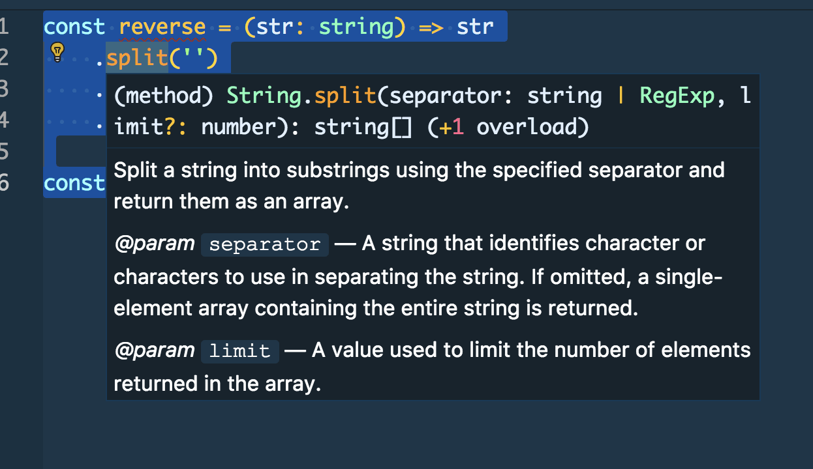
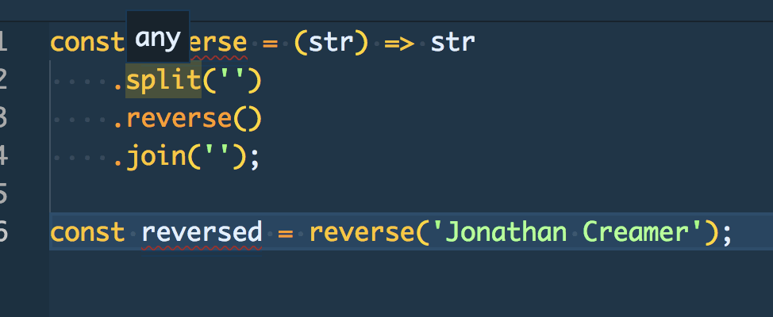

# Basic Types
---
## You probably already know a bunch of them...
---
### They're the same as JS really
* `number`
* `string`
* `boolean`
* `Date`
* `Array`
* `Object`
---
### TypeScript knows declared types already

```js
const age = 30;
const name = 'Jonathan Creamer';
const birthday = new Date(1988, 05, 18);
```

---
### Add types to function params

```js
const reverse = (str: string) => str
    .split('')
    .reverse()
    .join('');

const reversed = reverse('Jonathan Creamer');
```

---
### Your editor (aka vscode) knows things now



---
### If it was JS it's all  ¯\_(ツ)_/¯



---

---
# The end

export { default as theme } from '../../theme'